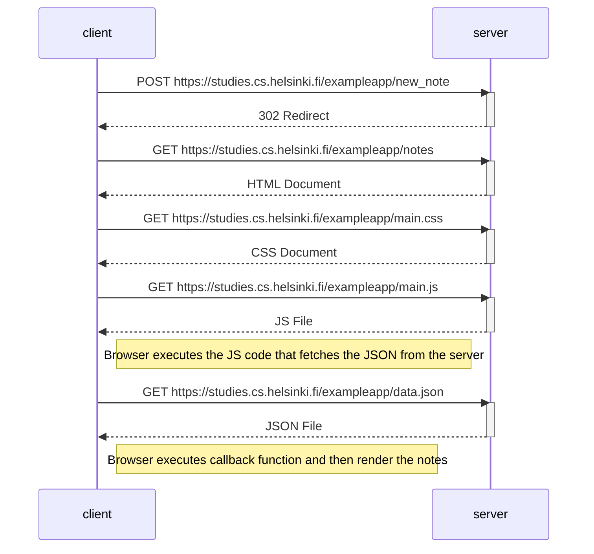

```mermaid
    sequenceDiagram
        participant client
        participant server
        client ->> server: POST https://studies.cs.helsinki.fi/exampleapp/new_note
        activate server
        server -->> client: 302 Redirect
        deactivate server

        client ->> server: GET https://studies.cs.helsinki.fi/exampleapp/notes
        activate server
        server -->> client: HTML Document
        deactivate server

        client ->> server: GET https://studies.cs.helsinki.fi/exampleapp/main.css
        activate server
        server -->> client: CSS Document
        deactivate server

        client ->> server: GET https://studies.cs.helsinki.fi/exampleapp/main.js
        activate server
        server -->> client: JS File
        deactivate server

        Note right of client: Browser executes  the JS code that fetches the JSON from the server

        client ->> server: GET https://studies.cs.helsinki.fi/exampleapp/data.json
        activate server
        server -->> client: JSON File
        deactivate server

        Note right of client: Browser executes callback function and then render the notes
```
