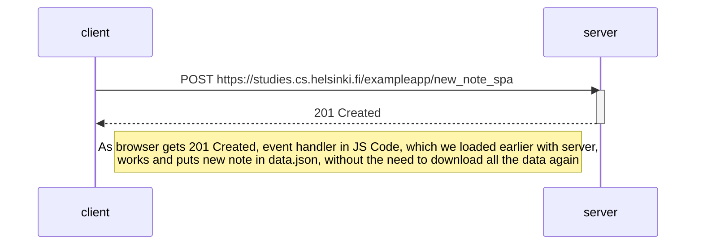

```mermaid
    sequenceDiagram
        participant client
        participant server

        client ->> server: POST https://studies.cs.helsinki.fi/exampleapp/new_note_spa
        activate server
        server -->> client: 201 Created
        deactivate server
        Note right of client: As browser gets 201 Created, event handler in JS Code, which we loaded earlier with server,<br/> works and puts new note in data.json, without the need to download all the data again
```
